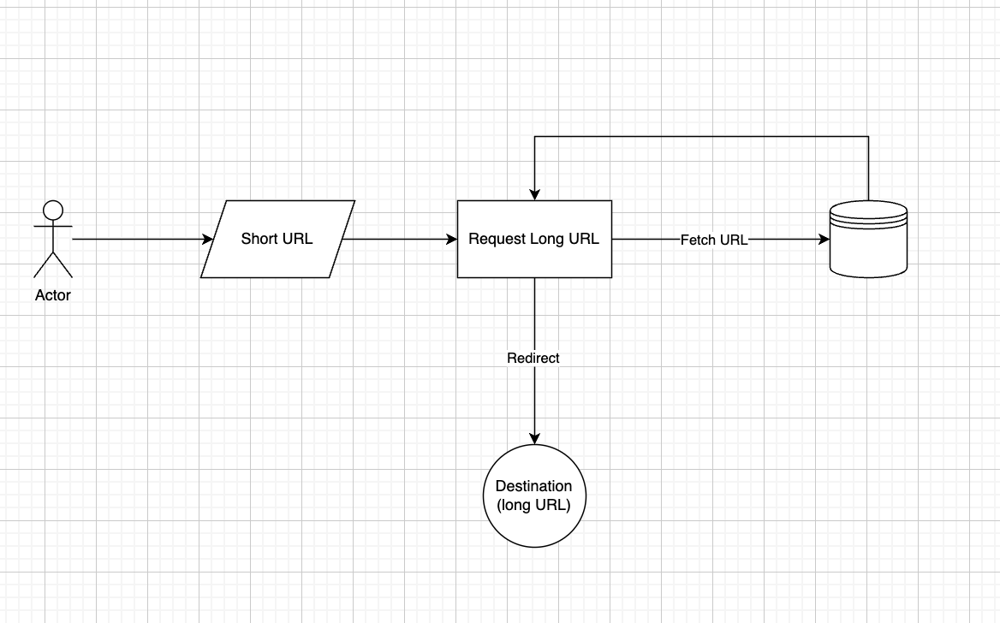

# URL Shortener API

A simple, fast, and reliable URL shortening service built with PHP and PostgreSQL. This application provides a clean REST API for creating short URLs and redirecting to original destinations.

## Features

- **Short URL Generation**: Create 8-character short codes for long URLs
- **Instant Redirection**: Fast HTTP redirects to original URLs
- **REST API**: Clean JSON API for integration
- **Database Persistence**: PostgreSQL backend for reliability
- **Docker Ready**: Complete containerized setup
- **CORS Support**: Cross-origin requests enabled
- **Input Validation**: Comprehensive URL validation and sanitization
- **Health Check**: Built-in API health monitoring

## 📋 Table of Contents

- [Quick Start](#quick-start)
- [API Documentation](#api-documentation)
- [Architecture](#architecture)
- [Development](#development)
- [Deployment](#deployment)
- [Troubleshooting](#troubleshooting)
- [Contributing](#contributing)

## Quick Start

### Prerequisites

- Docker and Docker Compose
- Git

### Installation

1. **Clone the repository**
   ```bash
   git clone <repository-url>
   cd url-shortener
   ```

2. **Start the application**
   ```bash
   docker-compose up -d
   ```

3. **Verify installation**
   ```bash
   curl http://localhost:8080/
   ```

The application will be available at `http://localhost:8080`.

## API Documentation

### Base URL
```
http://localhost:8080
```

### Endpoints

#### 1. Health Check
Get API status and database connectivity information.

**Endpoint:** `GET /`

**Response:**
```json
{
  "message": "URL Shortener API",
  "version": "1.0.0",
  "status": "ready",
  "database": {
    "status": "connected",
    "urls_table_exists": true,
    "urls_count": 5
  },
  "endpoints": {
    "health": "GET /",
    "shorten": "POST /api/shorten",
    "redirect": "GET /{shortCode}"
  }
}
```

#### 2. Shorten URL
Create a short URL from a long URL.

**Endpoint:** `POST /api/shorten`

**Headers:**
```
Content-Type: application/json
```

**Request Body:**
```json
{
  "url": "https://www.example.com/very/long/url/path"
}
```

**Response:**
```json
{
  "success": true,
  "data": {
    "id": 1,
    "original_url": "https://www.example.com/very/long/url/path",
    "short_code": "abcd1234",
    "short_url": "http://localhost:8080/abcd1234",
    "created_at": "2025-09-21 16:08:11.524370"
  },
  "message": "URL shortened successfully"
}
```

**Error Response:**
```json
{
  "success": false,
  "error": "Invalid URL format. Only HTTP and HTTPS URLs are allowed"
}
```

#### 3. Redirect Short URL
Redirect to the original URL using the short code.

**Endpoint:** `GET /{shortCode}`

**Example:** `GET /abcd1234`

**Response:** HTTP 301 redirect to the original URL

**Error Response:** HTTP 404 if short code not found

### Error Codes

| HTTP Status | Description |
|-------------|-------------|
| 200 | Success |
| 201 | URL created successfully |
| 301 | Redirect to original URL |
| 400 | Bad request (invalid JSON, missing URL, invalid URL format) |
| 404 | Short code not found |
| 405 | Method not allowed |
| 500 | Internal server error |

## Architecture

### System Flow

The URL shortener follows a simple request-response pattern with two main scenarios:

**Scenario 1: Creating a Short URL**


1. Client sends POST request with original URL
2. Server generates unique 8-character short code
3. URL and short code are stored in PostgreSQL database
4. Server responds with short URL

**Scenario 2: Redirecting Short URL**


1. Client requests short URL (GET /{shortCode})
2. Server looks up original URL in database
3. Server responds with HTTP 301 redirect to original URL
4. Client browser follows redirect to destination

### Project Structure

```

### Technology Stack

- **Backend**: PHP 8.2
- **Database**: PostgreSQL 15
- **Web Server**: Apache 2.4
- **Containerization**: Docker & Docker Compose

### Key Components

1. **Request/Response Services**: Handle HTTP request parsing and response formatting
2. **Database Service**: Singleton pattern for database connections
3. **URL Model**: Encapsulates URL operations and short code generation
4. **Controllers**: Handle business logic for different endpoints
5. **Routing**: Simple path-based routing in `index.php`

## 🛠️ Development

### Local Development Setup

1. **Clone and start services**
   ```bash
   git clone <repository-url>
   cd url-shortener
   docker-compose up -d
   ```

2. **View logs**
   ```bash
   docker-compose logs -f web
   ```

3. **Access database**
   ```bash
   docker-compose exec db psql -U postgres -d url_shortener
   ```

### Testing the API

**Create a short URL:**
```bash
curl -X POST http://localhost:8080/api/shorten \
  -H "Content-Type: application/json" \
  -d '{"url": "https://www.example.com"}'
```

**Test redirect:**
```bash
curl -I http://localhost:8080/{shortCode}
```

**Check health:**
```bash
curl http://localhost:8080/
```


## Troubleshooting

### Common Issues


**1. Database Connection Issues**
- Verify PostgreSQL container is running: `docker-compose ps`
- Check database logs: `docker-compose logs db`
- Ensure database credentials match in `docker-compose.yml`

**2. Port Already in Use**
- Change port mapping in `docker-compose.yml`
- Stop conflicting services: `sudo lsof -i :8080`

**3. Permission Issues**
- Ensure Docker has proper permissions
- Check file ownership: `ls -la src/`

### Debugging

**Enable PHP error reporting** (already enabled in development):
```php
error_reporting(E_ALL);
ini_set('display_errors', 1);
```

**View application logs:**
```bash
docker-compose logs -f web
```

**Access database directly:**
```bash
docker-compose exec db psql -U postgres -d url_shortener -c "SELECT * FROM urls;"
```

## 🤝 Contributing

1. Fork the repository
2. Create a feature branch: `git checkout -b feature-name`
3. Make your changes and test them
4. Commit your changes: `git commit -am 'Add feature'`
5. Push to the branch: `git push origin feature-name`
6. Submit a pull request

### Development Guidelines

- Follow PSR-12 coding standards
- Add tests for new features
- Update documentation for API changes
- Ensure Docker setup works correctly

## 📄 License

This project is licensed under the MIT License. See the LICENSE file for details.
